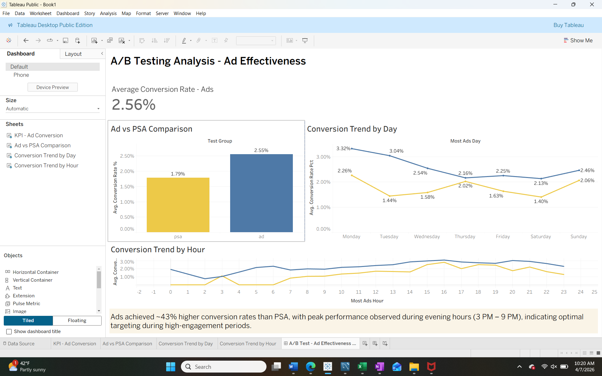

# A/B Test Analysis – Ad Campaign Effectiveness

## Overview
This project analyzes the effectiveness of advertising campaigns compared to PSA campaigns using A/B testing techniques.

## Key Insights
- Ads achieved ~43% higher conversion rates compared to PSA
- Peak performance observed during evening hours (3 PM - 9 PM)
- Conversion trends remain consistent across days

## Dashboard

## Tools Used
- SQL (Data querying, aggregation, analysis)
- Tableau (Dashboard & visualization)

## SQL Analysis
SQL was used to:
- Aggregate conversion rates across test groups
- Analyze trends by day and hour
- Compare performance between ad and PSA groups

## Business Recommendations
- Prioritize ad campaigns over PSA for higher conversions
- Allocate more budget during peak evening hours
- Continuously monitor hourly performance trends
